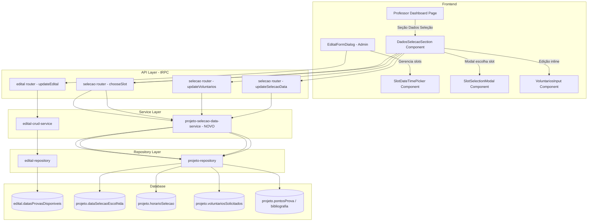

# Design Document: Seleção de Datas e Horários

## Overview

Este design cobre as funcionalidades faltantes no fluxo de seleção de datas e horários do sistema de monitoria DCC/UFBA. O fluxo é: Admin configura opções de data/horário no edital → Professor escolhe um slot e preenche dados da seleção → PDF reflete os dados.

As principais entregas são:
1. **UI Admin** para gerenciar slots de data/horário (objetos estruturados) no formulário de edital
2. **UI Professor** para selecionar um slot, definir voluntários e visualizar/editar pontos de prova e bibliografia
3. **Migração de dados** de `string[]` para `{data: string, horario: string}[]` no campo `datasProvasDisponiveis`
4. **Integração com PDF** já existente (nenhuma alteração no template necessária — já consome `dataSelecaoEscolhida`, `horarioSelecao`, `pontosProva`, `bibliografia`)

### Decisões de Design

| Decisão | Rationale |
|---------|-----------|
| Manter `datasProvasDisponiveis` como TEXT(JSON) no banco | Evita migration complexa; campo já existe e é interpretado como JSON |
| Estrutura do slot: `{data: string, horario: string}` | Mínimo necessário; `data` no formato ISO date, `horario` como faixa legível (ex: "14:00-16:00") |
| Professor edita voluntários na seção "Dados da Seleção" | Centraliza toda interação de seleção num único lugar |
| Modal com radio buttons para escolha de slot | Padrão já usado no sistema (Radix Dialog); simples e claro |
| Template fallback para pontos/bibliografia mantido | PDF service já implementa fallback — professor vê valores pré-preenchidos vindos do template |

## Architecture



### Camadas

1. **Frontend Components** — Componentes React com React Hook Form + Zod para validação client-side
2. **tRPC Routers** — Endpoints tipados para mutations/queries
3. **Services** — Lógica de negócio (validação, autorização, transformação)
4. **Repositories** — Acesso ao banco via Drizzle ORM

## Components and Interfaces

### Novos Componentes Frontend

#### 1. `SlotDateTimePicker` (Admin)
- **Local**: `src/components/features/edital/SlotDateTimePicker.tsx`
- **Props**:
  ```typescript
  interface SlotDateTimePickerProps {
    value: SlotDataHorario[]
    onChange: (slots: SlotDataHorario[]) => void
    minSlots?: number  // default 2
    maxSlots?: number  // default 3
    disabled?: boolean
  }
  ```
- **Comportamento**: Renderiza lista de slots com campos date + horário. Botão "Adicionar" (desabilitado se max atingido). Botão "Remover" em cada slot (desabilitado se min atingido).

#### 2. `DadosSelecaoSection` (Professor Dashboard)
- **Local**: `src/components/features/projeto/DadosSelecaoSection.tsx`
- **Props**:
  ```typescript
  interface DadosSelecaoSectionProps {
    projeto: DashboardProjectItem
    slotsDisponiveis: SlotDataHorario[]
    onSlotChosen: (slot: SlotDataHorario) => void
    onVoluntariosUpdate: (value: number) => void
    onPontosProvaUpdate: (value: string) => void
    onBibliografiaUpdate: (value: string) => void
  }
  ```
- **Comportamento**: Exibe card com: data/horário escolhido (ou botão para definir), voluntários editáveis, pontos de prova e bibliografia em textareas.

#### 3. `SlotSelectionModal` (Professor)
- **Local**: `src/components/features/projeto/SlotSelectionModal.tsx`
- **Props**:
  ```typescript
  interface SlotSelectionModalProps {
    open: boolean
    onOpenChange: (open: boolean) => void
    slots: SlotDataHorario[]
    currentSelection?: SlotDataHorario
    onConfirm: (slot: SlotDataHorario) => void
    isLoading?: boolean
  }
  ```
- **Comportamento**: Radix Dialog com RadioGroup listando slots formatados. Botão confirmar.

### Novos Endpoints tRPC

#### Router: `selecao` (existente, expandir)

```typescript
// Escolher slot de data/horário para um projeto
chooseSelecaoSlot: protectedProcedure
  .input(z.object({
    projetoId: z.number(),
    data: z.string(),      // ISO date string
    horario: z.string(),   // ex: "14:00-16:00"
  }))
  .mutation(...)

// Atualizar voluntários solicitados
updateVoluntarios: protectedProcedure
  .input(z.object({
    projetoId: z.number(),
    voluntariosSolicitados: z.number().int().min(0),
  }))
  .mutation(...)

// Atualizar pontos de prova e/ou bibliografia
updateSelecaoData: protectedProcedure
  .input(z.object({
    projetoId: z.number(),
    pontosProva: z.string().optional(),
    bibliografia: z.string().optional(),
  }))
  .mutation(...)
```

#### Router: `edital` (existente, modificar)

O endpoint `updateEdital` já aceita `datasProvasDisponiveis: string[]`. Mudamos a tipagem para aceitar `SlotDataHorario[]` (objetos) e serializar no service.

### Novo Service

#### `projeto-selecao-data-service.ts`
- **Local**: `src/server/services/projeto/projeto-selecao-data-service.ts`
- **Factory**: `createProjetoSelecaoDataService(repo: ProjetoRepository)`
- **Métodos**:
  - `chooseSlot(projetoId, data, horario, userId, userRole)` — Valida que o slot pertence ao edital vinculado, atualiza `dataSelecaoEscolhida` e `horarioSelecao`
  - `updateVoluntarios(projetoId, value, userId, userRole)` — Valida >= 0, atualiza `voluntariosSolicitados`
  - `updateSelecaoData(projetoId, pontosProva?, bibliografia?, userId, userRole)` — Atualiza campos textuais

### Tipos Compartilhados

```typescript
// src/types/selecao.ts (novo ou adicionado a selecao-inputs.ts)
export interface SlotDataHorario {
  data: string   // formato ISO: "2025-03-15"
  horario: string // formato legível: "14:00-16:00"
}
```

## Data Models

### Mudança no campo `datasProvasDisponiveis`

**Antes** (armazenamento atual):
```json
["2025-03-15 14:00-16:00", "2025-03-17 14:00-16:00"]
```

**Depois** (novo formato estruturado):
```json
[
  {"data": "2025-03-15", "horario": "14:00-16:00"},
  {"data": "2025-03-17", "horario": "14:00-16:00"}
]
```

**Estratégia de migração**: Como o campo é TEXT com JSON.stringify, basta alterar o service layer para serializar/deserializar o novo formato. Não há migration SQL necessária — o campo continua TEXT. Dados existentes (se houver) devem ser tratados no deserializer com fallback para string legada.

### Schemas Zod

```typescript
// Validação para slots no formulário do Admin
export const slotDataHorarioSchema = z.object({
  data: z.string().regex(/^\d{4}-\d{2}-\d{2}$/),
  horario: z.string().min(1),
})

export const datasProvasDisponiveisSchema = z
  .array(slotDataHorarioSchema)
  .min(2, 'Mínimo 2 opções de data/horário')
  .max(3, 'Máximo 3 opções de data/horário')
```

### Campos do banco afetados (todos já existem)

| Tabela | Campo | Tipo | Uso |
|--------|-------|------|-----|
| `edital` | `datasProvasDisponiveis` | TEXT | JSON array de `SlotDataHorario[]` |
| `projeto` | `dataSelecaoEscolhida` | DATE | Data escolhida pelo professor |
| `projeto` | `horarioSelecao` | VARCHAR(20) | Horário escolhido |
| `projeto` | `localSelecao` | VARCHAR(255) | Local (mantido, não alterado nesta feature) |
| `projeto` | `voluntariosSolicitados` | INTEGER | Voluntários definidos pelo professor |
| `projeto` | `pontosProva` | TEXT | Tópicos da prova |
| `projeto` | `bibliografia` | TEXT | Bibliografia da seleção |


## Correctness Properties

*A property is a characteristic or behavior that should hold true across all valid executions of a system — essentially, a formal statement about what the system should do. Properties serve as the bridge between human-readable specifications and machine-verifiable correctness guarantees.*

### Property 1: Slot serialization round-trip

*For any* valid array of `SlotDataHorario` objects (2–3 items, each with a valid ISO date string and non-empty horário string), serializing with `JSON.stringify` and then deserializing with `JSON.parse` SHALL produce an array deeply equal to the original.

**Validates: Requirements 1.4**

### Property 2: Chosen slot must belong to available slots

*For any* projeto linked to an edital with configured `datasProvasDisponiveis`, and *for any* slot submitted via `chooseSelecaoSlot`, the operation SHALL succeed if and only if the submitted `{data, horario}` pair matches exactly one of the slots in the edital's `datasProvasDisponiveis` array.

**Validates: Requirements 2.3**

### Property 3: Voluntários validation (non-negative integer)

*For any* integer value submitted to `updateVoluntarios`, the operation SHALL succeed if the value is ≥ 0, and SHALL reject with a validation error if the value is negative.

**Validates: Requirements 3.2, 3.4**

### Property 4: Template fallback for pontos de prova and bibliografia

*For any* projeto where `pontosProva` is null and the associated discipline template has a `pontosProvaDefault`, the value displayed to the professor SHALL equal the template's `pontosProvaDefault`. The same applies for `bibliografia`/`bibliografiaDefault`.

**Validates: Requirements 4.2, 4.3**

### Property 5: PDF exam schedule includes exactly projetos with selection date

*For any* set of projetos linked to an edital, the PDF data's exam schedule section (6.2.3) SHALL contain exactly those projetos where `dataSelecaoEscolhida` is non-null, and SHALL omit all projetos where `dataSelecaoEscolhida` is null.

**Validates: Requirements 5.1, 5.3**

### Property 6: PDF section 6.3 includes exactly projetos with pontos or bibliografia

*For any* set of projetos linked to an edital, the PDF data's section 6.3 SHALL include exactly those projetos where at least one of `pontosProva`, `bibliografia`, or the corresponding template defaults is non-null and non-empty.

**Validates: Requirements 5.2, 5.4**

### Property 7: PDF volunteer count reflects voluntariosSolicitados

*For any* projeto with a `voluntariosSolicitados` value, the PDF data mapping SHALL set `numVoluntarios` to exactly the value of `voluntariosSolicitados`.

**Validates: Requirements 5.5**

## Error Handling

### Erros de Validação (Client-side + Server-side)

| Cenário | Mensagem | Onde |
|---------|----------|------|
| Admin: menos de 2 slots | "Mínimo 2 opções de data/horário" | Form validation (Zod) |
| Admin: mais de 3 slots | "Máximo 3 opções de data/horário" | UI disabled button + Zod |
| Admin: data inválida no slot | "Data inválida" | Zod regex validation |
| Admin: horário vazio | "Horário é obrigatório" | Zod min(1) |
| Professor: slot não pertence ao edital | "Opção de data/horário inválida" | Service layer (400) |
| Professor: voluntários negativo | "Valor deve ser zero ou positivo" | Zod min(0) + Service |
| Professor: projeto não vinculado a edital | "Projeto não está vinculado a um edital interno" | Service (404/400) |
| Professor: acesso a projeto de outro professor | "Acesso negado a este projeto" | Service (403, ForbiddenError) |

### Erros de Sistema

| Cenário | Tratamento |
|---------|-----------|
| Falha ao deserializar `datasProvasDisponiveis` (dados legados) | Fallback para array vazio + log warning |
| Edital não encontrado | NotFoundError (404) |
| Projeto não encontrado | NotFoundError (404) |
| Erro de banco ao persistir | InternalServerError (500) + log error |

### Estratégia de Fallback para Dados Legados

O deserializer de `datasProvasDisponiveis` deve aceitar ambos os formatos:
```typescript
function parseSlots(raw: string | null): SlotDataHorario[] {
  if (!raw) return []
  try {
    const parsed = JSON.parse(raw)
    if (!Array.isArray(parsed)) return []
    // Se o primeiro item é string (formato legado), converter
    if (typeof parsed[0] === 'string') {
      return parsed.map((s: string) => {
        const [data, horario] = s.split(' ')
        return { data: data || '', horario: horario || '' }
      })
    }
    // Formato novo: array de objetos
    return parsed.filter((s: any) => s.data && s.horario)
  } catch {
    return []
  }
}
```

## Testing Strategy

### Property-Based Tests (via `fast-check`)

O projeto usa TypeScript + Vitest. Usaremos `fast-check` para property-based testing.

**Configuração**:
- Mínimo 100 iterações por propriedade
- Cada teste deve referenciar a propriedade do design document via tag no describe/it
- Tag format: `Feature: selecao-datas-horarios, Property {N}: {title}`

**Testes de propriedade planejados** (7 propriedades):
1. Serialization round-trip para SlotDataHorario[]
2. Membership validation para chooseSlot
3. Validação de voluntários (non-negative)
4. Template fallback para pontos/bibliografia
5. PDF filter para exam schedule
6. PDF filter para section 6.3
7. PDF mapping de voluntariosSolicitados

### Unit Tests (Vitest)

**Testes de exemplo/edge-case planejados**:
- Zod schema rejeita array com 0, 1 ou 4+ slots
- Zod schema rejeita datas em formato inválido
- SlotSelectionModal renderiza todos os slots como radio options
- DadosSelecaoSection exibe botão "Definir Data" quando não há seleção
- DadosSelecaoSection exibe seleção atual quando já escolhida
- Botão desabilitado quando edital não tem slots configurados
- Campo bolsistas é read-only
- Deserializer parseSlots lida com formato legado (string[])
- Deserializer parseSlots lida com JSON inválido

### Integration Tests

- Fluxo completo: criar edital com slots → professor escolhe slot → verificar dados no banco
- Gerar PDF com projetos que têm/não têm dados de seleção → verificar estrutura do PDF data

### Cobertura

| Camada | Tipo de Teste | Ferramenta |
|--------|---------------|------------|
| Zod schemas | Property + Edge cases | fast-check + Vitest |
| Service logic | Property + Unit | fast-check + Vitest |
| PDF mapping | Property | fast-check + Vitest |
| UI Components | Unit (render) | Vitest + Testing Library |
| API endpoints | Integration | Vitest + tRPC caller |
