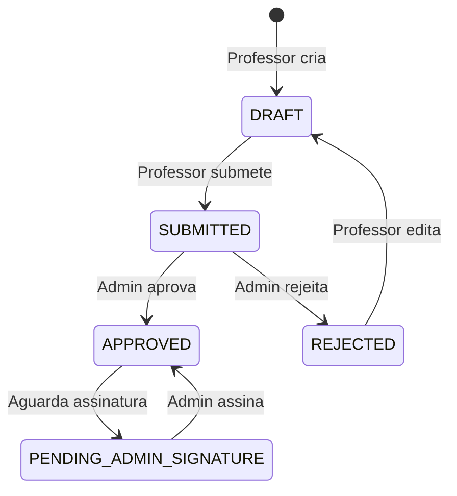

# Sistema de Monitoria IC - UFBA

[](https://opensource.org/licenses/MIT)
[](https://nodejs.org)
[](https://www.typescriptlang.org/)

Sistema web completo para gerenciar o Programa de Monitoria do Instituto de Computação da UFBA, automatizando todo o fluxo desde a proposta de projetos pelos professores até a seleção final dos monitores.

## 📋 Índice

- [Visão Geral](#-visão-geral)
- [Funcionalidades](#-funcionalidades)
- [Arquitetura](#-arquitetura)
- [Tech Stack](#-tech-stack)
- [Instalação](#-instalação)
- [Estrutura do Projeto](#-estrutura-do-projeto)
- [Fluxo de Trabalho](#-fluxo-de-trabalho)
- [API Reference](#-api-reference)
- [Desenvolvimento](#-desenvolvimento)
- [Deploy](#-deploy)
- [Contribuindo](#-contribuindo)

## 🎯 Visão Geral

O Sistema de Monitoria IC digitaliza e automatiza todo o processo de gestão de monitorias acadêmicas, que anteriormente era feito manualmente com documentos físicos e planilhas. O sistema atende três tipos de usuários principais:

- **Administradores**: Gerenciam todo o sistema, aprovam projetos, definem bolsas
- **Professores**: Criam projetos de monitoria, selecionam candidatos
- **Alunos**: Inscrevem-se em vagas, acompanham resultados

### Principais Benefícios

- ✅ Eliminação de processos manuais e papelada física
- ✅ Centralização de informações em tempo real
- ✅ Transparência no processo seletivo
- ✅ Geração automática de relatórios para PROGRAD
- ✅ Controle de vagas e validações automáticas

## 🚀 Funcionalidades

### Para Administradores

- **Gestão de Projetos**
  - Aprovar/rejeitar propostas de monitoria
  - Definir número de bolsas disponíveis
  - Acompanhar status de todos os projetos
  
- **Gestão Acadêmica**
  - Cadastro de departamentos, cursos e disciplinas
  - Vinculação de professores às disciplinas
  - Definição de períodos de inscrição
  
- **Relatórios e Analytics**
  - Geração de planilhas Excel para PROGRAD
  - Dashboard com métricas em tempo real
  - Exportação de dados por período/departamento

### Para Professores

- **Criação de Projetos**
  - Formulário completo com objetivos e atividades
  - Definição de carga horária e número de vagas
  - Upload de documentos assinados
  
- **Seleção de Monitores**
  - Visualização de inscritos com filtros
  - Avaliação e seleção de candidatos
  - Gestão separada de bolsistas e voluntários

### Para Alunos

- **Inscrições**
  - Busca de projetos disponíveis
  - Inscrição em múltiplos projetos
  - Upload de documentos necessários
  
- **Acompanhamento**
  - Visualização clara de resultados
  - Aceitar/recusar ofertas de vaga
  - Histórico de inscrições

### Funcionalidades do Sistema

- 🔐 **Autenticação via CAS** da UFBA
- 📄 **Upload seguro de documentos** via MinIO
- 📧 **Notificações por email** automáticas
- 📊 **Validações automáticas** (ex: máximo 1 bolsa por aluno)
- 🔄 **Fluxo de aprovação** multi-etapas
- 📱 **Interface responsiva** para todos dispositivos

## 🏗️ Arquitetura

O sistema utiliza uma arquitetura moderna full-stack com TypeScript:

```
┌─────────────────┐     ┌─────────────────┐     ┌─────────────────┐
│                 │     │                 │     │                 │
│   Frontend      │────▶│   API Routes    │────▶│   Database      │
│   (React)       │     │   (TanStack)    │     │   (PostgreSQL)  │
│                 │     │                 │     │                 │
└─────────────────┘     └─────────────────┘     └─────────────────┘
         │                       │                        │
         │                       │                        │
         ▼                       ▼                        ▼
┌─────────────────┐     ┌─────────────────┐     ┌─────────────────┐
│   UI Library    │     │  Middleware     │     │   File Storage  │
│   (shadcn/ui)   │     │  (Auth/Roles)   │     │    (MinIO)      │
└─────────────────┘     └─────────────────┘     └─────────────────┘
```

### Padrões Arquiteturais

- **File-based Routing**: Rotas automáticas baseadas na estrutura de arquivos
- **Type-safe APIs**: Endpoints totalmente tipados com TypeScript
- **Middleware Pattern**: Autenticação e autorização em camadas
- **Repository Pattern**: Abstração de acesso a dados com Drizzle ORM
- **Component Composition**: UI modular com shadcn/ui

## 🛠️ Tech Stack

### Core
- **Framework**: [TanStack Start](https://tanstack.com/start) (formerly Vinxi)
- **Frontend**: [React 19](https://react.dev/) + [TypeScript](https://www.typescriptlang.org/)
- **Routing**: [TanStack Router](https://tanstack.com/router) - Type-safe routing
- **State Management**: [TanStack Query](https://tanstack.com/query) - Server state
- **Database**: [PostgreSQL](https://www.postgresql.org/) + [Drizzle ORM](https://orm.drizzle.team/)
- **Authentication**: [Lucia Auth](https://lucia-auth.com/) + CAS Integration

### UI & Styling
- **Components**: [shadcn/ui](https://ui.shadcn.com/) (Radix UI + Tailwind)
- **Styling**: [Tailwind CSS](https://tailwindcss.com/)
- **Forms**: [React Hook Form](https://react-hook-form.com/) + [Zod](https://zod.dev/)
- **Icons**: [Lucide React](https://lucide.dev/)

### Backend Services
- **File Storage**: [MinIO](https://min.io/) (S3-compatible)
- **Email**: [Nodemailer](https://nodemailer.com/) (migrating to Resend)
- **Excel Generation**: [SheetJS](https://sheetjs.com/)
- **Logging**: [Pino](https://getpino.io/)

### Development
- **Package Manager**: npm (10.9.0+)
- **Node Version**: 22.14.0+
- **Testing**: [Vitest](https://vitest.dev/)
- **Database Management**: Docker + Docker Compose

## 📦 Instalação

### Pré-requisitos

- Node.js 22.14.0+ (use `nvm` para gerenciar versões)
- npm 10.9.0+
- Docker e Docker Compose
- Git

### Setup Rápido

1. **Clone o repositório**
```bash
git clone https://github.com/seu-usuario/sistema-de-monitoria-ic
cd sistema-de-monitoria-ic
```

2. **Configure as variáveis de ambiente**
```bash
cp .env.sample .env
# Edite .env com suas configurações
```

3. **Instale as dependências**
```bash
nvm use  # Usa a versão correta do Node
npm install
```

4. **Inicie o banco de dados**
```bash
docker compose up -d
```

5. **Execute as migrações**
```bash
npm run db:migrate
```

6. **Inicie o servidor de desenvolvimento**
```bash
npm run dev
```

7. **Acesse a aplicação**
```
http://localhost:3000
```

Para mais detalhes, consulte o [Guia de Configuração Completo](./docs/setup-guide.md).

## 📁 Estrutura do Projeto

```
sistema-de-monitoria-ic/
├── src/
│   ├── routes/                 # Rotas (file-based routing)
│   │   ├── api/               # API endpoints
│   │   │   ├── auth/          # Autenticação
│   │   │   ├── projeto/       # Gestão de projetos
│   │   │   ├── inscricao/     # Inscrições
│   │   │   └── relatorios/    # Relatórios
│   │   └── home/              # Páginas do frontend
│   │       └── _layout/       # Layouts por role
│   │           ├── admin/     # Dashboard admin
│   │           ├── professor/ # Dashboard professor
│   │           └── student/   # Dashboard aluno
│   ├── server/                # Lógica backend
│   │   ├── database/          # Schema e migrações
│   │   ├── lib/              # Utilitários (email, auth)
│   │   └── middleware/       # Auth e role middleware
│   ├── components/           # Componentes React
│   │   ├── ui/              # shadcn/ui components
│   │   ├── features/        # Feature components
│   │   └── layout/          # Layout components
│   ├── hooks/               # Custom React hooks
│   └── utils/               # Utilitários gerais
├── docs/                    # Documentação
├── public/                  # Assets estáticos
└── docker-compose.yml       # Config do banco
```

### Principais Arquivos

- `src/api.ts` - Configuração do handler de API
- `src/client.tsx` - Entry point do cliente com providers
- `src/server/database/schema.ts` - Schema do banco de dados
- `src/routes/` - Todas as rotas da aplicação
- `CLAUDE.md` - Documentação para IA assistente

## 🔄 Fluxo de Trabalho

### 1. Ciclo de Vida do Projeto



### 2. Processo de Inscrição

1. **Período de Inscrição**: Admin define datas de início/fim
2. **Inscrição**: Aluno se candidata aos projetos
3. **Seleção**: Professor avalia e seleciona candidatos
4. **Resultado**: Aluno é notificado (SELECTED_BOLSISTA/VOLUNTARIO)
5. **Aceitação**: Aluno aceita/recusa a vaga
6. **Confirmação**: Vaga é confirmada no sistema

### 3. Validações Importantes

- ✅ Aluno pode ter apenas **1 bolsa por semestre**
- ✅ Aluno pode ter **múltiplas vagas voluntárias**
- ✅ Inscrições apenas durante **período ativo**
- ✅ Projetos devem estar **APPROVED** para inscrições

## 📡 API Reference

### Autenticação
- `GET /api/auth/cas-login` - Inicia login CAS
- `GET /api/auth/cas-callback` - Callback do CAS
- `POST /api/auth/logout` - Logout do usuário
- `GET /api/auth/me` - Dados do usuário atual

### Projetos
- `GET /api/projeto` - Lista projetos
- `POST /api/projeto` - Cria projeto
- `GET /api/projeto/:id` - Detalhes do projeto
- `POST /api/projeto/:id/submit` - Submete para aprovação
- `POST /api/projeto/:id/approve` - Aprova projeto (admin)
- `POST /api/projeto/:id/reject` - Rejeita projeto (admin)

### Inscrições
- `GET /api/inscricao` - Minhas inscrições (aluno)
- `POST /api/monitoria/inscricao` - Nova inscrição
- `POST /api/inscricao/:id/aceitar` - Aceita vaga
- `POST /api/inscricao/:id/recusar` - Recusa vaga
- `GET /api/projeto/:id/inscricoes` - Lista inscritos (professor)

### Relatórios
- `GET /api/relatorios/planilhas-prograd` - Gera Excel PROGRAD

## 💻 Desenvolvimento

### Comandos Úteis

```bash
# Desenvolvimento
npm run dev              # Inicia servidor dev
npm run build           # Build de produção
npm run start           # Executa build

# Banco de Dados
npm run db:generate     # Gera migrações
npm run db:migrate      # Aplica migrações
npm run db:studio       # Drizzle Studio GUI
npm run db:push        # Push direto (dev)

# Testes
npm run test           # Executa testes
npm run test:coverage  # Coverage report

# Docker
docker compose up -d    # Inicia serviços
docker compose down     # Para serviços
docker compose logs -f  # Ver logs
```

### Convenções de Código

- **TypeScript**: Strict mode, tipos explícitos
- **React**: Functional components, custom hooks
- **Naming**: 
  - Components: `PascalCase`
  - Hooks: `camelCase` com prefixo `use`
  - API routes: `kebab-case`
  - Database: `snake_case`
- **Git**: Conventional commits (`feat:`, `fix:`, `docs:`)

### Estrutura de Hooks

```typescript
// hooks/use-projetos.ts
export function useProjetos() {
  return useQuery({
    queryKey: ['projetos'],
    queryFn: () => apiClient.get('/api/projeto')
  });
}
```

### Estrutura de API Routes

```typescript
// routes/api/exemplo.ts
export const APIRoute = createAPIFileRoute('/api/exemplo')({
  GET: createAPIHandler(
    withAuthMiddleware(
      withRoleMiddleware(['admin'])(async (ctx) => {
        // Implementação
        return json(data);
      })
    )
  ),
});
```

## 🚀 Deploy

### Heroku (Atual)

```bash
# Deploy automático via GitHub
git push origin main

# Deploy manual
./deploy.sh
```

### Variáveis de Ambiente (Produção)

```env
DATABASE_URL=postgres://...
REDIS_URL=redis://...
MINIO_ENDPOINT=...
MINIO_ACCESS_KEY=...
MINIO_SECRET_KEY=...
RESEND_API_KEY=...
CAS_LOGIN_URL=...
CAS_VALIDATE_URL=...
NODE_ENV=production
```

## 🤝 Contribuindo

1. **Fork** o projeto
2. **Clone** seu fork
3. **Crie** uma branch (`git checkout -b feature/AmazingFeature`)
4. **Commit** suas mudanças (`git commit -m 'feat: Add amazing feature'`)
5. **Push** para a branch (`git push origin feature/AmazingFeature`)
6. **Abra** um Pull Request

### Guidelines

- Siga as convenções de código existentes
- Adicione testes para novas features
- Atualize a documentação conforme necessário
- Use conventional commits
- Certifique-se que `npm run build` passa

## 📄 Licença

Este projeto está sob a licença MIT. Veja o arquivo [LICENSE](LICENSE) para mais detalhes.

## 🏛️ Sobre

Desenvolvido para o **Instituto de Computação da UFBA** como parte do esforço de digitalização e modernização dos processos acadêmicos.

---

**Dúvidas?** Abra uma [issue](https://github.com/seu-usuario/sistema-de-monitoria-ic/issues) ou entre em contato com a equipe de desenvolvimento.