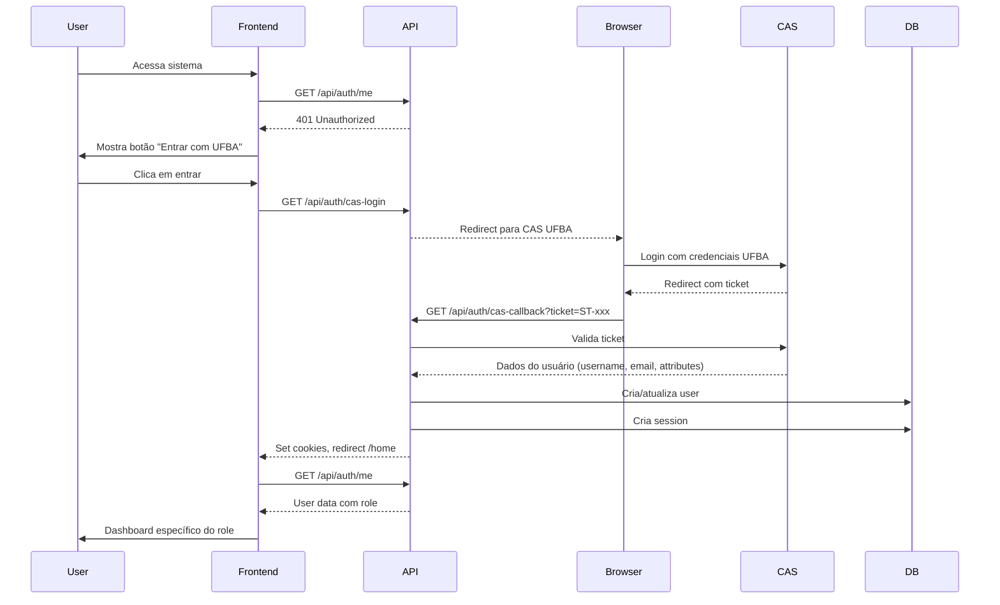
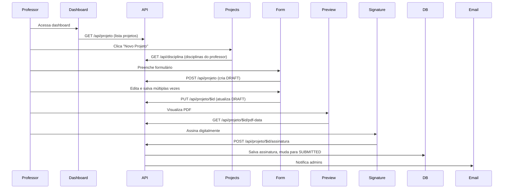
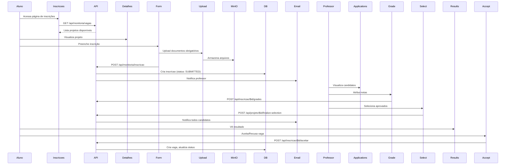

# Documentação Completa e Detalhada - Sistema de Monitoria IC para Migração Next.js + tRPC

## 1. VISÃO GERAL COMPLETA DO SISTEMA

### Propósito e Escopo
O Sistema de Monitoria IC é uma plataforma web completa para gerenciamento do programa de monitoria acadêmica da UFBA (Universidade Federal da Bahia). O sistema cobre todo o ciclo de vida do processo de monitoria:

1. **Criação de Projetos**: Professores criam propostas de monitoria
2. **Aprovação Administrativa**: Admins analisam e aprovam projetos
3. **Publicação de Editais**: Sistema gera e publica editais oficiais
4. **Inscrições de Alunos**: Estudantes se inscrevem nos projetos
5. **Seleção de Monitores**: Professores avaliam e selecionam candidatos
6. **Gestão de Bolsas**: Administração aloca bolsas e voluntários
7. **Documentação e Assinaturas**: Sistema digital de assinatura de documentos

### Stack Tecnológica Detalhada

#### Frontend (TanStack Start)
```typescript
// Estrutura atual de uma rota típica
export const Route = createFileRoute('/home/_layout/professor/_layout/dashboard')({
  component: DashboardProfessor,
});

// Migração para Next.js
export default function ProfessorDashboardPage() {
  // Component logic
}
```

#### API (TanStack Start API Routes)
```typescript
// Atual: src/routes/api/projeto/index.ts
export const APIRoute = createAPIFileRoute('/api/projeto')({
  GET: createAPIHandler(
    withAuthMiddleware(async (ctx) => {
      // Logic
    })
  ),
});

// Migração para tRPC
export const projetoRouter = router({
  list: protectedProcedure.query(async ({ ctx }) => {
    // Logic
  }),
});
```

## 2. ESTRUTURA DETALHADA DO BANCO DE DADOS

### 2.1 Tabelas de Autenticação

#### user
```sql
-- Tabela central de usuários
CREATE TABLE user (
  id SERIAL PRIMARY KEY,
  username TEXT NOT NULL UNIQUE,     -- Login UFBA (ex: 'joao.silva')
  email TEXT NOT NULL UNIQUE,        -- Email UFBA (ex: 'joao.silva@ufba.br')
  role user_role NOT NULL DEFAULT 'student', -- admin, professor, student
  assinatura_default TEXT,           -- Base64 da assinatura padrão (admins)
  data_assinatura_default TIMESTAMP
);
```

**Exemplos de Uso**:
- Admin cria assinatura padrão para assinar editais
- Professor/Student herdam dados do CAS UFBA

#### session (Lucia Auth)
```sql
CREATE TABLE session (
  id TEXT PRIMARY KEY,
  user_id INTEGER REFERENCES user(id),
  expires_at TIMESTAMP NOT NULL
);
```

### 2.2 Estrutura Acadêmica

#### departamento
```sql
CREATE TABLE departamento (
  id SERIAL PRIMARY KEY,
  unidade_universitaria VARCHAR NOT NULL, -- Ex: 'Instituto de Computação'
  nome VARCHAR NOT NULL,                  -- Ex: 'Departamento de Ciência da Computação'
  sigla VARCHAR                          -- Ex: 'DCC'
);
```

#### disciplina
```sql
CREATE TABLE disciplina (
  id SERIAL PRIMARY KEY,
  nome VARCHAR NOT NULL,           -- Ex: 'Programação I'
  codigo VARCHAR NOT NULL,         -- Ex: 'MATA37'
  departamento_id INTEGER REFERENCES departamento(id)
);
```

### 2.3 Fluxo de Projetos

#### projeto
```sql
CREATE TABLE projeto (
  id SERIAL PRIMARY KEY,
  departamento_id INTEGER REFERENCES departamento(id),
  ano INTEGER NOT NULL,                     -- Ex: 2024
  semestre semestre_enum NOT NULL,          -- SEMESTRE_1, SEMESTRE_2
  tipo_proposicao tipo_proposicao_enum,     -- INDIVIDUAL, COLETIVA
  bolsas_solicitadas INTEGER DEFAULT 0,
  voluntarios_solicitados INTEGER DEFAULT 0,
  bolsas_disponibilizadas INTEGER DEFAULT 0, -- Admin define após aprovação
  titulo VARCHAR NOT NULL,
  descricao TEXT NOT NULL,
  status projeto_status_enum DEFAULT 'DRAFT',
  assinatura_professor TEXT,                -- Base64 da assinatura
  feedback_admin TEXT,
  professor_responsavel_id INTEGER REFERENCES professor(id)
);
```

**Estados do Projeto**:
```
DRAFT → SUBMITTED → APPROVED/REJECTED → PENDING_ADMIN_SIGNATURE → APPROVED (Final)
         ↓
    PENDING_PROFESSOR_SIGNATURE (importação)
```

## 3. MAPEAMENTO DETALHADO DE ROTAS

### 3.1 Estrutura de Rotas Frontend

#### Rotas Públicas
```typescript
/ (index.tsx)                           // Landing page
/auth/cas-callback                      // Callback do CAS UFBA
/auth/accept-invitation                 // Aceitar convite de professor
/public/editais                         // Editais públicos
```

#### Rotas Autenticadas (/home)
```typescript
/home/_layout.tsx                       // Layout principal com Sidebar
  ├── /admin/_layout.tsx               // Proteção de role admin
  │   ├── dashboard.tsx                // Dashboard administrativo
  │   ├── manage-projects.tsx          // Gerenciar projetos
  │   ├── document-signing.tsx         // Assinar documentos
  │   └── ...
  ├── /professor/_layout.tsx           // Proteção de role professor
  │   ├── dashboard.tsx                // Dashboard do professor
  │   ├── projects.tsx                 // Criar/editar projetos
  │   └── ...
  └── /student/_layout.tsx             // Proteção de role student
      ├── dashboard.tsx                // Dashboard do aluno
      ├── inscricao-monitoria.tsx      // Inscrever-se em projetos
      └── resultados.tsx               // Ver resultados
```

### 3.2 Estrutura de Rotas API

#### Autenticação (/api/auth)
```typescript
// cas-login/index.ts
GET: redireciona para CAS UFBA com service callback

// cas-callback/index.ts
GET: processa ticket CAS, cria/atualiza usuário, inicia sessão

// me/index.ts
GET: retorna dados do usuário autenticado

// logout/index.ts
POST: destrói sessão, limpa cookies
```

#### Projetos (/api/projeto)
```typescript
// index.ts
GET: lista projetos (filtrado por role)
POST: cria novo projeto (professor/admin)

// $id/index.ts
GET: detalhes do projeto
PUT: atualiza projeto
DELETE: exclui projeto (apenas DRAFT)

// $id/submit.ts
POST: submete projeto para aprovação

// $id/approve.ts
POST: admin aprova projeto

// $id/assinatura.ts
POST: assina projeto digitalmente
```

## 4. FLUXOS DETALHADOS DO SISTEMA

### 4.1 Fluxo Completo de Autenticação CAS



**Implementação Atual**:
```typescript
// src/routes/api/auth/cas-login/index.ts
export const APIRoute = createAPIFileRoute('/api/auth/cas-login')({
  GET: createAPIHandler(async () => {
    const casLoginUrl = `${CAS_BASE_URL}/login?service=${encodeURIComponent(SERVICE_URL)}`;
    return redirect(casLoginUrl);
  }),
});

// src/routes/api/auth/cas-callback/service.ts
export async function handleCasCallback(ticket: string) {
  // 1. Valida ticket com CAS
  const userData = await validateCasTicket(ticket);
  
  // 2. Busca ou cria usuário
  const user = await findOrCreateUser(userData);
  
  // 3. Cria sessão Lucia
  const session = await lucia.createSession(user.id, {});
  
  return { user, session };
}
```

### 4.2 Fluxo de Criação de Projeto (Professor)



**Componentes Envolvidos**:
```typescript
// src/components/features/projects/ProjectForm.tsx
export function ProjectForm({ projeto, onSuccess }: ProjectFormProps) {
  const form = useForm<ProjectFormData>({
    resolver: zodResolver(projectSchema),
    defaultValues: projeto || getDefaultValues(),
  });

  const createProjeto = useCreateProjeto();
  const updateProjeto = useUpdateProjeto();

  const onSubmit = async (data: ProjectFormData) => {
    if (projeto) {
      await updateProjeto.mutateAsync({ id: projeto.id, data });
    } else {
      await createProjeto.mutateAsync(data);
    }
  };
}

// src/components/features/projects/InteractiveProjectPDF.tsx
export function InteractiveProjectPDF({ formData, userRole, onSignatureComplete }) {
  // Renderiza PDF com react-pdf
  // Gerencia modal de assinatura
  // Envia assinatura para API
}
```

### 4.3 Fluxo de Assinatura Digital

O sistema implementa um fluxo completo de assinatura digital para diferentes tipos de documentos:

#### 4.3.1 Assinatura de Projeto pelo Professor
```typescript
// src/routes/home/_layout/professor/_layout/document-signing.tsx
// Professor visualiza projeto e assina

// 1. Carrega projeto e gera PDF
const { data: pdfData } = useQuery({
  queryKey: ['projeto-pdf', projectId],
  queryFn: () => apiClient.get(`/api/projeto/${projectId}/pdf-data`),
});

// 2. Abre modal de assinatura
<SignatureConfirmationModal
  isOpen={showSignatureModal}
  onConfirm={handleSignDocument}
  signatureData={signatureData}
/>

// 3. Envia assinatura
const handleSignDocument = async (signature: string) => {
  await apiClient.post(`/api/projeto/${projectId}/assinatura`, {
    assinatura: signature,
    tipoAssinatura: 'PROJETO_PROFESSOR_RESPONSAVEL',
  });
};
```

#### 4.3.2 Assinatura de Projeto pelo Admin
```typescript
// src/routes/home/_layout/admin/_layout/document-signing.tsx
// Admin aprova e assina projetos

// Lista projetos PENDING_ADMIN_SIGNATURE
const pendingSignatureProjetos = projetos?.filter(
  (projeto) => projeto.status === 'PENDING_ADMIN_SIGNATURE'
);

// Fluxo de assinatura admin
const handleSignComplete = async () => {
  // 1. Gera PDF com assinatura
  // 2. Upload para MinIO
  // 3. Atualiza status para APPROVED
  // 4. Notifica professor
};
```

#### 4.3.3 Upload de Assinatura via Presigned URL
```typescript
// src/routes/api/files/admin/presigned-url.ts
// Gera URL segura para upload de arquivos assinados

POST: async (ctx) => {
  const { objectName } = await ctx.request.json();
  
  // Gera URL pré-assinada do MinIO
  const url = await minioClient.presignedPutObject(
    bucketName,
    objectName,
    60 * 60 // 1 hora de validade
  );
  
  return json({ url, fileName, mimeType });
}
```

### 4.4 Fluxo de Inscrição de Alunos



**Validações Importantes**:
- Aluno só pode aceitar 1 bolsa por semestre
- Pode aceitar múltiplas vagas voluntárias
- Documentos obrigatórios variam por tipo de vaga

### 4.5 Fluxo de Importação em Lote (Admin)

```typescript
// src/routes/home/_layout/admin/_layout/import-projects.tsx
// Admin importa planilha Excel com projetos

const handleFileUpload = async (file: File) => {
  // 1. Upload arquivo
  const formData = new FormData();
  formData.append('file', file);
  
  // 2. Processa importação
  const response = await apiClient.post('/api/projeto/import-planning', formData);
  
  // 3. Projetos criados com status PENDING_PROFESSOR_SIGNATURE
  // 4. Notifica professores para assinarem
};

// src/routes/api/projeto/import-planning.ts
// Processa Excel e cria projetos
const processExcelFile = async (fileBuffer: Buffer) => {
  const workbook = XLSX.read(fileBuffer);
  const sheet = workbook.Sheets[workbook.SheetNames[0]];
  const data = XLSX.utils.sheet_to_json(sheet);
  
  for (const row of data) {
    // Valida dados
    // Busca professor por SIAPE
    // Cria projeto com template
    // Define status PENDING_PROFESSOR_SIGNATURE
  }
};
```

## 5. COMPONENTES PRINCIPAIS DO SISTEMA

### 5.1 Componentes de Layout

#### Sidebar.tsx
```typescript
// src/components/layout/Sidebar.tsx
// Menu lateral dinâmico baseado em roles

const menuConfig: MenuConfig[] = [
  // Admin
  {
    label: 'Projetos',
    icon: FileText,
    roles: ['admin'],
    items: [
      {
        label: 'Gerenciar Projetos',
        href: '/home/admin/manage-projects',
        icon: FileText,
        roles: ['admin'],
      },
      // ...
    ],
  },
  // Professor
  {
    label: 'Meus Projetos',
    icon: FileText,
    roles: ['professor'],
    items: [
      {
        label: 'Dashboard',
        href: '/home/professor/dashboard',
        icon: LayoutDashboard,
        roles: ['professor'],
      },
      // ...
    ],
  },
  // Student
  {
    label: 'Monitoria',
    icon: GraduationCap,
    roles: ['student'],
    items: [
      {
        label: 'Inscrição em Monitoria',
        href: '/home/student/inscricao-monitoria',
        icon: FilePlus,
        roles: ['student'],
      },
      // ...
    ],
  },
];

// Renderização condicional baseada em role
const filteredMenuConfig = menuConfig.filter((config) => {
  if (!user?.role) return false;
  return config.roles.includes(user.role as UserRole);
});
```

#### PagesLayout.tsx
```typescript
// src/components/layout/PagesLayout.tsx
// Layout padrão para páginas com título e ações

export function PagesLayout({ title, subtitle, actions, children }: Props) {
  return (
    <div className="flex-1 space-y-4 p-8 pt-6">
      <div className="flex items-center justify-between">
        <div>
          <h2 className="text-3xl font-bold tracking-tight">{title}</h2>
          {subtitle && <p className="text-muted-foreground">{subtitle}</p>}
        </div>
        {actions && <div className="flex gap-2">{actions}</div>}
      </div>
      <Separator />
      {children}
    </div>
  );
}
```

### 5.2 Componentes de Projetos

#### ProjectForm.tsx
```typescript
// src/components/features/projects/ProjectForm.tsx
// Formulário completo de criação/edição de projeto

export function ProjectForm({ projeto, onSuccess }: ProjectFormProps) {
  // Estados do formulário
  const [selectedDisciplinas, setSelectedDisciplinas] = useState<Disciplina[]>([]);
  const [atividades, setAtividades] = useState<string[]>([]);
  
  // Hooks de dados
  const { data: disciplinas } = useDisciplinas();
  const { data: departamentos } = useDepartamentos();
  
  // Validação com Zod
  const form = useForm<ProjectFormData>({
    resolver: zodResolver(projectFormSchema),
    defaultValues: projeto || defaultValues,
  });
  
  // Seções do formulário
  return (
    <Form {...form}>
      <form onSubmit={form.handleSubmit(onSubmit)} className="space-y-8">
        {/* Identificação do Projeto */}
        <ProjectIdentificationSection form={form} />
        
        {/* Dados do Projeto */}
        <Card>
          <CardHeader>
            <CardTitle>Dados do Projeto</CardTitle>
          </CardHeader>
          <CardContent className="space-y-4">
            {/* Título, Descrição, etc */}
          </CardContent>
        </Card>
        
        {/* Vagas */}
        <ProjectVacanciesSection form={form} />
        
        {/* Atividades */}
        <Card>
          <CardHeader>
            <CardTitle>Atividades do Monitor</CardTitle>
          </CardHeader>
          <CardContent>
            {atividades.map((atividade, index) => (
              // Lista de atividades com add/remove
            ))}
          </CardContent>
        </Card>
        
        <Button type="submit">
          {projeto ? 'Atualizar' : 'Criar'} Projeto
        </Button>
      </form>
    </Form>
  );
}
```

#### InteractiveProjectPDF.tsx
```typescript
// src/components/features/projects/InteractiveProjectPDF.tsx
// Visualização e assinatura de PDF do projeto

export function InteractiveProjectPDF({
  formData,
  userRole,
  onSignatureComplete,
}: Props) {
  const [showSignatureModal, setShowSignatureModal] = useState(false);
  const [signatureData, setSignatureData] = useState<string | null>(null);
  
  // Busca dados do PDF e assinatura existente
  const { data: pdfData } = useProjectPdfData(formData.projetoId);
  
  // Gera PDF com react-pdf
  const pdfContent = (
    <Document>
      <Page size="A4" style={styles.page}>
        {/* Cabeçalho UFBA */}
        <View style={styles.header}>
          <Image src="/images/logo-ufba.png" style={styles.logo} />
          {/* ... */}
        </View>
        
        {/* Conteúdo do projeto */}
        <View style={styles.content}>
          {/* Renderiza todos os campos */}
        </View>
        
        {/* Área de assinatura */}
        {pdfData?.assinaturaProfessor && (
          <View style={styles.signatureArea}>
            <Image src={pdfData.assinaturaProfessor} />
          </View>
        )}
      </Page>
    </Document>
  );
  
  // Modal de assinatura
  return (
    <>
      <PDFViewer>{pdfContent}</PDFViewer>
      
      <SignatureConfirmationModal
        isOpen={showSignatureModal}
        onConfirm={handleSignDocument}
        signatureData={signatureData}
      />
    </>
  );
}
```

### 5.3 Componentes de Inscrição

#### SelecaoDeVagaTable.tsx
```typescript
// src/components/features/registration/SelecaoDeVagaTable.tsx
// Tabela de seleção de vagas para inscrição

export function SelecaoDeVagaTable({ projetos, onSelect }: Props) {
  const [selectedProjeto, setSelectedProjeto] = useState<ProjetoVaga | null>(null);
  const [tipoVaga, setTipoVaga] = useState<'BOLSISTA' | 'VOLUNTARIO'>('BOLSISTA');
  
  const columns: ColumnDef<ProjetoVaga>[] = [
    {
      accessorKey: 'disciplina',
      header: 'Disciplina',
      cell: ({ row }) => (
        <div>
          <span className="font-semibold">{row.original.codigoDisciplina}</span>
          <span className="text-sm text-muted-foreground block">
            {row.original.nomeDisciplina}
          </span>
        </div>
      ),
    },
    {
      accessorKey: 'professor',
      header: 'Professor Orientador',
    },
    {
      accessorKey: 'vagas',
      header: 'Vagas',
      cell: ({ row }) => (
        <div className="flex gap-4">
          <Badge variant="default">
            {row.original.bolsasDisponiveis} bolsas
          </Badge>
          <Badge variant="secondary">
            {row.original.voluntariosDisponiveis} voluntários
          </Badge>
        </div>
      ),
    },
    {
      id: 'actions',
      cell: ({ row }) => (
        <Button
          onClick={() => handleSelectProject(row.original)}
          disabled={!hasAvailableSlots(row.original)}
        >
          Selecionar
        </Button>
      ),
    },
  ];
  
  return (
    <>
      <DataTable columns={columns} data={projetos} />
      
      {/* Modal de confirmação */}
      <Dialog open={!!selectedProjeto} onOpenChange={() => setSelectedProjeto(null)}>
        <DialogContent>
          <DialogHeader>
            <DialogTitle>Confirmar Inscrição</DialogTitle>
          </DialogHeader>
          {/* Seleção de tipo de vaga e confirmação */}
        </DialogContent>
      </Dialog>
    </>
  );
}
```

#### DocumentUploader.tsx
```typescript
// src/components/features/registration/DocumentoUploadItem.tsx
// Upload de documentos obrigatórios

export function DocumentoUploadItem({
  documento,
  onUpload,
  onRemove,
  uploadedFile,
}: Props) {
  const [isUploading, setIsUploading] = useState(false);
  const { uploadFile } = useFileUpload();
  
  const handleFileSelect = async (file: File) => {
    // Validações
    if (file.size > 5 * 1024 * 1024) {
      toast.error('Arquivo muito grande. Máximo 5MB.');
      return;
    }
    
    if (!['application/pdf', 'image/jpeg', 'image/png'].includes(file.type)) {
      toast.error('Formato inválido. Apenas PDF, JPG ou PNG.');
      return;
    }
    
    setIsUploading(true);
    try {
      // Upload para MinIO
      const result = await uploadFile.mutateAsync({
        file,
        tipo: documento.tipo,
      });
      
      onUpload({
        fileId: result.fileId,
        fileName: file.name,
        fileSize: file.size,
        mimeType: file.type,
      });
    } finally {
      setIsUploading(false);
    }
  };
  
  return (
    <div className="p-4 border rounded-lg">
      <div className="flex justify-between items-start">
        <div>
          <h4 className="font-medium">{documento.nome}</h4>
          <p className="text-sm text-muted-foreground">{documento.descricao}</p>
        </div>
        
        {uploadedFile ? (
          <div className="flex items-center gap-2">
            <CheckCircle className="h-5 w-5 text-green-500" />
            <span className="text-sm">{uploadedFile.fileName}</span>
            <Button
              variant="ghost"
              size="sm"
              onClick={() => onRemove()}
            >
              <X className="h-4 w-4" />
            </Button>
          </div>
        ) : (
          <FileInput
            accept=".pdf,.jpg,.jpeg,.png"
            onChange={handleFileSelect}
            disabled={isUploading}
          />
        )}
      </div>
    </div>
  );
}
```

## 6. HOOKS CUSTOMIZADOS (TANSTACK QUERY)

### 6.1 Hook de Autenticação
```typescript
// src/hooks/use-auth.tsx
export function useAuth() {
  const { data: user, isLoading, error } = useQuery({
    queryKey: ['auth', 'me'],
    queryFn: async () => {
      const response = await apiClient.get('/api/auth/me');
      if (!response.ok) return null;
      return response.json();
    },
    retry: false,
    staleTime: 5 * 60 * 1000, // 5 minutos
  });
  
  const logout = useMutation({
    mutationFn: () => apiClient.post('/api/auth/logout'),
    onSuccess: () => {
      queryClient.invalidateQueries({ queryKey: ['auth'] });
      navigate({ to: '/' });
    },
  });
  
  return {
    user,
    isLoading,
    isAuthenticated: !!user,
    logout: logout.mutate,
  };
}
```

### 6.2 Hook de Projetos
```typescript
// src/hooks/use-projeto.ts
export function useProjetos() {
  return useQuery({
    queryKey: QUERY_KEYS.projetos.list(),
    queryFn: () => apiClient.get('/api/projeto').json<ProjetoListItem[]>(),
  });
}

export function useCreateProjeto() {
  const queryClient = useQueryClient();
  
  return useMutation({
    mutationFn: (data: CreateProjetoData) =>
      apiClient.post('/api/projeto', { json: data }).json<Projeto>(),
    onSuccess: () => {
      queryClient.invalidateQueries({ queryKey: QUERY_KEYS.projetos.list() });
      toast.success('Projeto criado com sucesso!');
    },
  });
}

export function useSubmitProjeto() {
  const queryClient = useQueryClient();
  
  return useMutation({
    mutationFn: ({ id, assinatura }: { id: number; assinatura: string }) =>
      apiClient.post(`/api/projeto/${id}/submit`, { json: { assinatura } }),
    onSuccess: (_, { id }) => {
      queryClient.invalidateQueries({ 
        queryKey: QUERY_KEYS.projetos.detail(id) 
      });
      toast.success('Projeto submetido para aprovação!');
    },
  });
}
```

### 6.3 Hook de Inscrições
```typescript
// src/hooks/use-inscricao.ts
export function useMinhasInscricoes() {
  const { user } = useAuth();
  
  return useQuery({
    queryKey: QUERY_KEYS.inscricoes.minhas(user?.id),
    queryFn: () => apiClient.get('/api/inscricao').json<Inscricao[]>(),
    enabled: !!user && user.role === 'student',
  });
}

export function useInscrever() {
  const queryClient = useQueryClient();
  
  return useMutation({
    mutationFn: (data: InscricaoData) =>
      apiClient.post('/api/monitoria/inscricao', { json: data }),
    onSuccess: () => {
      queryClient.invalidateQueries({ 
        queryKey: QUERY_KEYS.inscricoes.minhas() 
      });
      queryClient.invalidateQueries({ 
        queryKey: QUERY_KEYS.monitoria.vagasDisponiveis() 
      });
      toast.success('Inscrição realizada com sucesso!');
    },
    onError: (error) => {
      if (error.message.includes('já inscrito')) {
        toast.error('Você já está inscrito neste projeto!');
      } else {
        toast.error('Erro ao realizar inscrição');
      }
    },
  });
}
```

### 6.4 Hook de Upload de Arquivos
```typescript
// src/hooks/use-files.ts
export function useFileUpload() {
  return useMutation({
    mutationFn: async ({ file, tipo }: { file: File; tipo: string }) => {
      // 1. Obter URL pré-assinada
      const { uploadUrl, fileId } = await apiClient
        .post('/api/files/upload/request', {
          json: {
            fileName: file.name,
            fileSize: file.size,
            mimeType: file.type,
            tipo,
          },
        })
        .json<UploadRequestResponse>();
      
      // 2. Upload direto para MinIO
      await fetch(uploadUrl, {
        method: 'PUT',
        body: file,
        headers: {
          'Content-Type': file.type,
        },
      });
      
      // 3. Confirmar upload
      await apiClient.post('/api/files/upload/confirm', {
        json: { fileId },
      });
      
      return { fileId, fileName: file.name };
    },
  });
}
```

## 7. MIDDLEWARE E SEGURANÇA

### 7.1 Middleware de Autenticação
```typescript
// src/server/middleware/auth.ts
export const withAuthMiddleware = (
  handler: APIHandler
): APIHandler => async (ctx) => {
  const sessionId = parseCookies(ctx.request.headers.get('cookie')).auth_session;
  
  if (!sessionId) {
    return json({ error: 'Não autenticado' }, { status: 401 });
  }
  
  const { user, session } = await lucia.validateSession(sessionId);
  
  if (!session) {
    return json({ error: 'Sessão inválida' }, { status: 401 });
  }
  
  // Adiciona user ao contexto
  ctx.state.user = user;
  ctx.state.session = session;
  
  return handler(ctx);
};
```

### 7.2 Middleware de Roles
```typescript
// src/server/middleware/common.ts
export const withRoleMiddleware = (
  allowedRoles: UserRole[],
  handler: APIHandler
): APIHandler => async (ctx) => {
  const user = ctx.state.user;
  
  if (!user || !allowedRoles.includes(user.role)) {
    return json({ error: 'Acesso negado' }, { status: 403 });
  }
  
  return handler(ctx);
};

// Uso combinado
export const APIRoute = createAPIFileRoute('/api/admin/users')({
  GET: createAPIHandler(
    withAuthMiddleware(
      withRoleMiddleware(['admin'], async (ctx) => {
        // Apenas admins chegam aqui
      })
    )
  ),
});
```

## 8. SISTEMA DE NOTIFICAÇÕES E EMAIL

### 8.1 Templates de Email
```typescript
// src/server/lib/email-templates/professor-invitation.ts
export function professorInvitationEmail(data: {
  email: string;
  inviteLink: string;
  expiresAt: Date;
}) {
  return {
    subject: 'Convite para Sistema de Monitoria UFBA',
    html: `
      <div style="font-family: Arial, sans-serif; max-width: 600px; margin: 0 auto;">
        <header style="background-color: #1B2A50; color: white; padding: 20px;">
          <h1>Sistema de Monitoria UFBA</h1>
        </header>
        
        <main style="padding: 30px;">
          <h2>Você foi convidado!</h2>
          <p>Você recebeu um convite para se cadastrar como professor no Sistema de Monitoria da UFBA.</p>
          
          <div style="margin: 30px 0;">
            <a href="${data.inviteLink}" 
               style="background-color: #1B2A50; color: white; padding: 15px 30px; 
                      text-decoration: none; border-radius: 5px; display: inline-block;">
              Aceitar Convite
            </a>
          </div>
          
          <p style="color: #666; font-size: 14px;">
            Este convite expira em ${formatDate(data.expiresAt)}.
          </p>
        </main>
      </div>
    `,
  };
}
```

### 8.2 Serviço de Email
```typescript
// src/server/lib/emailService.ts
import { Resend } from 'resend';

const resend = new Resend(process.env.RESEND_API_KEY);

export async function sendEmail(data: EmailData) {
  try {
    const result = await resend.emails.send({
      from: 'Sistema de Monitoria <monitoria@ufba.br>',
      to: data.to,
      subject: data.subject,
      html: data.html,
      replyTo: 'coordenacao@ic.ufba.br',
    });
    
    // Registra no histórico
    await db.insert(notificacaoHistoricoTable).values({
      destinatarioEmail: data.to,
      assunto: data.subject,
      tipoNotificacao: data.tipo,
      statusEnvio: 'ENVIADO',
      dataEnvio: new Date(),
    });
    
    return result;
  } catch (error) {
    // Registra falha
    await db.insert(notificacaoHistoricoTable).values({
      destinatarioEmail: data.to,
      assunto: data.subject,
      tipoNotificacao: data.tipo,
      statusEnvio: 'FALHOU',
      dataEnvio: new Date(),
      mensagemErro: error.message,
    });
    
    throw error;
  }
}
```

## 9. GERAÇÃO DE PDFs E RELATÓRIOS

### 9.1 Geração de PDF do Projeto
```typescript
// src/server/lib/pdf-generation.ts
import { renderToBuffer } from '@react-pdf/renderer';

export async function generateProjectPDF(projeto: Projeto) {
  // Componente React PDF
  const MyDocument = (
    <Document>
      <Page size="A4" style={styles.page}>
        {/* Cabeçalho UFBA */}
        <View style={styles.header}>
          <Image src="/images/logo-ufba.png" style={styles.logo} />
          <Text style={styles.universityName}>
            UNIVERSIDADE FEDERAL DA BAHIA
          </Text>
        </View>
        
        {/* Título do Projeto */}
        <View style={styles.title}>
          <Text>PROPOSTA DE PROJETO DE MONITORIA</Text>
          <Text>{projeto.titulo}</Text>
        </View>
        
        {/* Dados do Projeto */}
        <View style={styles.section}>
          <Text style={styles.sectionTitle}>1. IDENTIFICAÇÃO</Text>
          <Text>Departamento: {projeto.departamento.nome}</Text>
          <Text>Professor Responsável: {projeto.professorResponsavel.nome}</Text>
          {/* ... mais campos ... */}
        </View>
        
        {/* Assinaturas */}
        {projeto.assinaturaProfessor && (
          <View style={styles.signatureArea}>
            <Image src={projeto.assinaturaProfessor} />
            <Text>Professor Responsável</Text>
            <Text>{new Date().toLocaleDateString('pt-BR')}</Text>
          </View>
        )}
      </Page>
    </Document>
  );
  
  // Gera buffer do PDF
  const pdfBuffer = await renderToBuffer(MyDocument);
  
  // Upload para MinIO
  const fileName = `projetos/${projeto.id}/proposta_${Date.now()}.pdf`;
  await minioClient.putObject(bucketName, fileName, pdfBuffer);
  
  return fileName;
}
```

### 9.2 Relatórios PROGRAD
```typescript
// src/server/lib/relatorios/prograd.ts
export async function generateProgradReport(filters: {
  ano: number;
  semestre: string;
  departamentoId?: number;
}) {
  // Busca dados
  const projetos = await db.query.projetoTable.findMany({
    where: and(
      eq(projetoTable.ano, filters.ano),
      eq(projetoTable.semestre, filters.semestre),
      eq(projetoTable.status, 'APPROVED'),
      filters.departamentoId 
        ? eq(projetoTable.departamentoId, filters.departamentoId)
        : undefined
    ),
    with: {
      departamento: true,
      professorResponsavel: true,
      vagas: {
        with: {
          aluno: true,
        },
      },
    },
  });
  
  // Gera Excel
  const workbook = new ExcelJS.Workbook();
  const worksheet = workbook.addWorksheet('Monitores');
  
  // Cabeçalhos
  worksheet.columns = [
    { header: 'Departamento', key: 'departamento', width: 30 },
    { header: 'Disciplina', key: 'disciplina', width: 20 },
    { header: 'Professor', key: 'professor', width: 30 },
    { header: 'Monitor', key: 'monitor', width: 30 },
    { header: 'Matrícula', key: 'matricula', width: 15 },
    { header: 'Tipo', key: 'tipo', width: 15 },
    { header: 'Início', key: 'inicio', width: 15 },
    { header: 'Fim', key: 'fim', width: 15 },
  ];
  
  // Dados
  projetos.forEach(projeto => {
    projeto.vagas.forEach(vaga => {
      worksheet.addRow({
        departamento: projeto.departamento.nome,
        disciplina: projeto.disciplinas[0]?.codigo,
        professor: projeto.professorResponsavel.nomeCompleto,
        monitor: vaga.aluno.nomeCompleto,
        matricula: vaga.aluno.matricula,
        tipo: vaga.tipo,
        inicio: formatDate(vaga.dataInicio),
        fim: formatDate(vaga.dataFim),
      });
    });
  });
  
  // Retorna buffer
  return await workbook.xlsx.writeBuffer();
}
```

## 10. PADRÕES E BOAS PRÁTICAS

### 10.1 Estrutura de Componentes
```typescript
// Componente típico com todas as features
export function MyFeatureComponent() {
  // 1. Hooks do router
  const navigate = useNavigate();
  const { id } = useParams();
  
  // 2. Hooks de autenticação
  const { user } = useAuth();
  
  // 3. Hooks de dados (queries)
  const { data, isLoading, error } = useMyData();
  
  // 4. Hooks de mutação
  const createMutation = useCreateItem();
  const updateMutation = useUpdateItem();
  
  // 5. Estado local
  const [isModalOpen, setIsModalOpen] = useState(false);
  
  // 6. Form com React Hook Form + Zod
  const form = useForm<FormData>({
    resolver: zodResolver(formSchema),
    defaultValues,
  });
  
  // 7. Handlers
  const handleSubmit = async (data: FormData) => {
    try {
      await createMutation.mutateAsync(data);
      toast.success('Sucesso!');
      navigate({ to: '/success' });
    } catch (error) {
      toast.error('Erro ao processar');
    }
  };
  
  // 8. Renderização condicional
  if (isLoading) return <LoadingSpinner />;
  if (error) return <ErrorMessage error={error} />;
  
  // 9. UI com shadcn/ui
  return (
    <PagesLayout title="Minha Feature">
      <Card>
        <CardHeader>
          <CardTitle>Título</CardTitle>
        </CardHeader>
        <CardContent>
          <Form {...form}>
            <form onSubmit={form.handleSubmit(handleSubmit)}>
              {/* Campos do formulário */}
            </form>
          </Form>
        </CardContent>
      </Card>
    </PagesLayout>
  );
}
```

### 10.2 Padrões de API
```typescript
// API Route padrão com todas as features
export const APIRoute = createAPIFileRoute('/api/resource/$id')({
  // GET - Buscar recurso
  GET: createAPIHandler(
    withAuthMiddleware(async (ctx) => {
      const { id } = ctx.params;
      
      try {
        const resource = await db.query.resourceTable.findFirst({
          where: eq(resourceTable.id, Number(id)),
          with: {
            relatedData: true,
          },
        });
        
        if (!resource) {
          return json({ error: 'Recurso não encontrado' }, { status: 404 });
        }
        
        // Verificar permissões
        if (!canAccessResource(ctx.state.user, resource)) {
          return json({ error: 'Acesso negado' }, { status: 403 });
        }
        
        return json(resource);
      } catch (error) {
        logger.error({ error, id }, 'Erro ao buscar recurso');
        return json({ error: 'Erro interno' }, { status: 500 });
      }
    })
  ),
  
  // PUT - Atualizar recurso
  PUT: createAPIHandler(
    withAuthMiddleware(
      withRoleMiddleware(['admin', 'owner'], async (ctx) => {
        const { id } = ctx.params;
        const body = await ctx.request.json();
        
        // Validar dados
        const validation = updateSchema.safeParse(body);
        if (!validation.success) {
          return json({ 
            error: 'Dados inválidos', 
            details: validation.error 
          }, { status: 400 });
        }
        
        // Atualizar no banco
        const [updated] = await db
          .update(resourceTable)
          .set(validation.data)
          .where(eq(resourceTable.id, Number(id)))
          .returning();
        
        // Invalidar cache
        await redis.del(`resource:${id}`);
        
        return json(updated);
      })
    )
  ),
});
```

## 11. MIGRAÇÃO PARA NEXT.JS + tRPC

### 11.1 Estrutura de Rotas Next.js
```typescript
// app/layout.tsx - Layout raiz
export default function RootLayout({ children }: { children: React.ReactNode }) {
  return (
    <html lang="pt-BR">
      <body>
        <Providers>
          {children}
        </Providers>
      </body>
    </html>
  );
}

// app/(auth)/layout.tsx - Layout para rotas autenticadas
export default async function AuthLayout({ children }: { children: React.ReactNode }) {
  const session = await getServerSession();
  
  if (!session) {
    redirect('/login');
  }
  
  return (
    <SidebarProvider>
      <div className="flex h-screen">
        <Sidebar />
        <main className="flex-1 overflow-y-auto">
          {children}
        </main>
      </div>
    </SidebarProvider>
  );
}

// app/(auth)/admin/layout.tsx - Proteção de role
export default async function AdminLayout({ children }: { children: React.ReactNode }) {
  const session = await getServerSession();
  
  if (session?.user.role !== 'admin') {
    notFound();
  }
  
  return children;
}
```

### 11.2 Estrutura tRPC
```typescript
// server/api/routers/projeto.ts
export const projetoRouter = router({
  // Query para listar projetos
  list: protectedProcedure
    .input(
      z.object({
        status: z.enum(['DRAFT', 'SUBMITTED', 'APPROVED']).optional(),
        departamentoId: z.number().optional(),
      }).optional()
    )
    .query(async ({ ctx, input }) => {
      const where = buildWhereClause(ctx.session.user, input);
      
      return ctx.db.query.projetoTable.findMany({
        where,
        with: {
          departamento: true,
          professorResponsavel: true,
          disciplinas: true,
        },
        orderBy: desc(projetoTable.createdAt),
      });
    }),
  
  // Mutation para criar projeto
  create: protectedProcedure
    .input(createProjetoSchema)
    .mutation(async ({ ctx, input }) => {
      // Verificar se é professor
      if (ctx.session.user.role !== 'professor') {
        throw new TRPCError({ code: 'FORBIDDEN' });
      }
      
      // Criar projeto em transação
      const projeto = await ctx.db.transaction(async (tx) => {
        const [projeto] = await tx
          .insert(projetoTable)
          .values({
            ...input,
            professorResponsavelId: ctx.session.user.professorId,
            status: 'DRAFT',
          })
          .returning();
        
        // Criar relações
        if (input.disciplinas?.length) {
          await tx.insert(projetoDisciplinaTable).values(
            input.disciplinas.map(d => ({
              projetoId: projeto.id,
              disciplinaId: d.id,
            }))
          );
        }
        
        return projeto;
      });
      
      return projeto;
    }),
  
  // Procedure para submeter projeto
  submit: protectedProcedure
    .input(
      z.object({
        id: z.number(),
        assinatura: z.string(),
      })
    )
    .mutation(async ({ ctx, input }) => {
      // Buscar projeto
      const projeto = await ctx.db.query.projetoTable.findFirst({
        where: and(
          eq(projetoTable.id, input.id),
          eq(projetoTable.professorResponsavelId, ctx.session.user.professorId)
        ),
      });
      
      if (!projeto) {
        throw new TRPCError({ code: 'NOT_FOUND' });
      }
      
      if (projeto.status !== 'DRAFT') {
        throw new TRPCError({ 
          code: 'BAD_REQUEST',
          message: 'Projeto já foi submetido' 
        });
      }
      
      // Atualizar status e assinatura
      await ctx.db
        .update(projetoTable)
        .set({
          status: 'SUBMITTED',
          assinaturaProfessor: input.assinatura,
        })
        .where(eq(projetoTable.id, input.id));
      
      // Notificar admins
      await notifyAdmins({
        type: 'PROJECT_SUBMITTED',
        projeto,
      });
      
      return { success: true };
    }),
});

// server/api/root.ts - Router principal
export const appRouter = router({
  auth: authRouter,
  projeto: projetoRouter,
  inscricao: inscricaoRouter,
  user: userRouter,
  // ... outros routers
});

export type AppRouter = typeof appRouter;
```

### 11.3 Hooks tRPC no Cliente
```typescript
// utils/api.ts
import { createTRPCNext } from '@trpc/next';
import type { AppRouter } from '@/server/api/root';

export const api = createTRPCNext<AppRouter>({
  config() {
    return {
      transformer: superjson,
      links: [
        loggerLink({
          enabled: (opts) =>
            process.env.NODE_ENV === 'development' ||
            (opts.direction === 'down' && opts.result instanceof Error),
        }),
        httpBatchLink({
          url: `${getBaseUrl()}/api/trpc`,
        }),
      ],
    };
  },
  ssr: false,
});

// Uso nos componentes
export function ProjectList() {
  // Query
  const { data: projetos, isLoading } = api.projeto.list.useQuery({
    status: 'APPROVED',
  });
  
  // Mutation
  const createProjeto = api.projeto.create.useMutation({
    onSuccess: () => {
      toast.success('Projeto criado!');
      router.refresh();
    },
  });
  
  // Optimistic updates
  const utils = api.useContext();
  const submitProjeto = api.projeto.submit.useMutation({
    onMutate: async ({ id }) => {
      await utils.projeto.list.cancel();
      const previousData = utils.projeto.list.getData();
      
      utils.projeto.list.setData(undefined, (old) => {
        if (!old) return old;
        return old.map((p) =>
          p.id === id ? { ...p, status: 'SUBMITTED' } : p
        );
      });
      
      return { previousData };
    },
    onError: (err, newData, context) => {
      utils.projeto.list.setData(undefined, context?.previousData);
    },
    onSettled: () => {
      utils.projeto.list.invalidate();
    },
  });
}
```

## 12. CONSIDERAÇÕES FINAIS

### Pontos Críticos para Migração

1. **Autenticação CAS**: Manter integração com Lucia Auth
2. **File Upload**: Preservar integração com MinIO
3. **PDF Generation**: Migrar componentes React PDF
4. **Email Templates**: Manter templates Resend
5. **Validações de Negócio**: Portar todas as regras

### Melhorias Sugeridas

1. **Cache Strategy**: Implementar Redis para sessões e cache
2. **Real-time Updates**: Adicionar WebSockets para notificações
3. **Batch Operations**: Otimizar operações em lote
4. **Error Tracking**: Integrar Sentry
5. **Analytics**: Adicionar Plausible/Umami

### Cronograma de Migração

1. **Fase 1** (2 semanas): Setup base + Autenticação
2. **Fase 2** (3 semanas): Routers tRPC principais
3. **Fase 3** (3 semanas): Páginas e componentes
4. **Fase 4** (2 semanas): Features avançadas
5. **Fase 5** (2 semanas): Testes e otimização
6. **Fase 6** (1 semana): Deploy e migração de dados

Total estimado: 13 semanas para migração completa com testes.